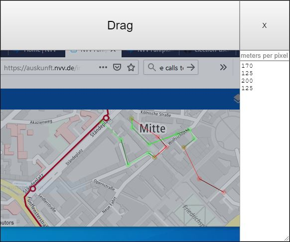

# path-measurement-tool

A program to click a polygon on the desktop, enter a scale, and save the calculated distances.



Shortcuts:

|Key|Function
|---|---|
|Z|undo|
|space|new path|
|Ctrl + N|reset|

## Development

Install nodejs.

Run in shell:

```sh
npm install
npx electron .
```

To distribute, run 

```
npx create-electron-app dist
cd dist 
npx electron-forge make
```

And zip the folder dist\out\dist-win32-x64 to distribute it.
